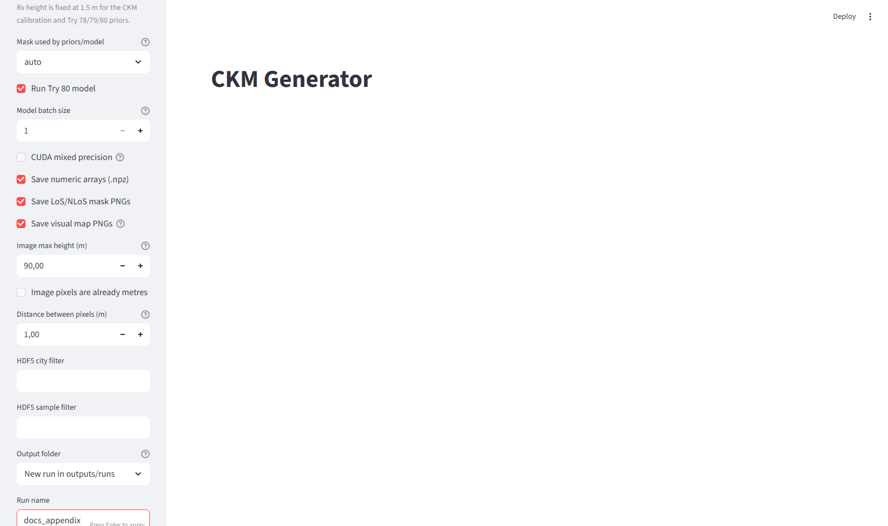
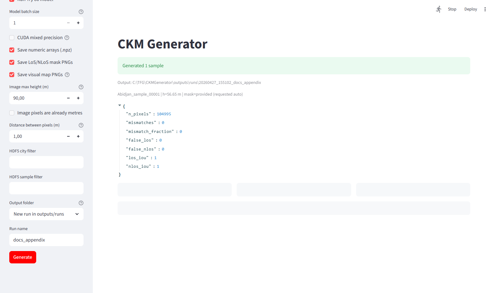
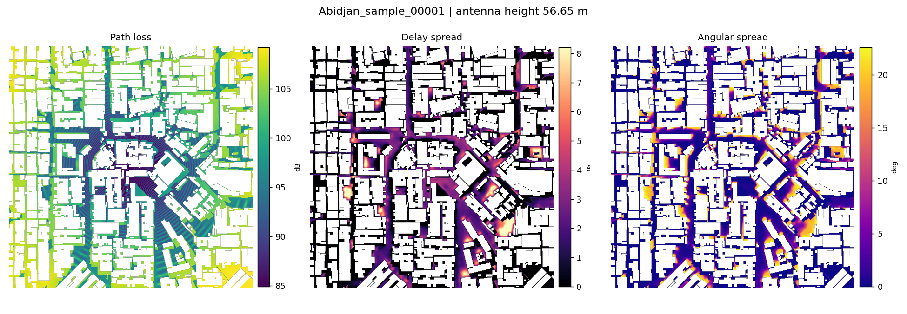

# CKM Generator

Standalone final generator for CKM topology inputs.

## How To Use

From PowerShell:

```powershell
cd C:\TFG\CKMGenerator
C:\Python310\python.exe -m pip install -r C:\TFG\CKMGenerator\requirements.txt
```

If you want to run with a different Python environment, replace
`C:\Python310\python.exe` with that environment's Python. Install the
dependencies in the same environment that will run the app or CLI. Also I recommend starting with the web interface. And in inputs/topology_png you have some examples to try.

Check the runtime first:

```powershell
C:\Python310\python.exe C:\TFG\CKMGenerator\ckm_doctor.py
```

Run the web interface:

```powershell
C:\Python310\python.exe -m streamlit run C:\TFG\CKMGenerator\ckm_app.py
```

Run from the terminal on one HDF5 sample:

```powershell
C:\Python310\python.exe C:\TFG\CKMGenerator\ckm_generate.py `
  --input C:\TFG\CKMGenerator\inputs\samples\Abidjan_sample_00001.h5 `
  --run-name abidjan_check `
  --mixed-precision
```

Run from the terminal on a topology image:

```powershell
C:\Python310\python.exe C:\TFG\CKMGenerator\ckm_generate.py `
  --input C:\path\topology_map.png `
  --height 56.65 `
  --topology-max-m 90 `
  --meters-per-pixel 1.0 `
  --run-name topology_demo `
  --mixed-precision
```

By default, outputs are written to `outputs/runs/<timestamp>_<run-name>`.
Use `--out C:\path\chosen_folder` to write somewhere specific.

Includes:

- `models/best_model.pt`: final joint prior-anchored residual GMM-head checkpoint copied from `try80_joint_huge_pathloss_finetune`, tracked with Git LFS.
- `calibrations/`: frozen calibration JSONs for the final ML-calibrated path-loss and spread priors.
- `src/ckm_generator/`: clean generator interface, CLI, Streamlit app, loaders, LoS/NLoS ray-caster, plotting.
- `vendor/`: copied historical training/runtime code for the final priors and residual GMM-head model.

`models/best_model.pt` is stored through Git LFS because the checkpoint is
larger than GitHub's regular file limit. After cloning, run `git lfs pull` if
the checkpoint was not downloaded automatically, or pass
`--checkpoint C:\path\best_model.pt` to use another compatible checkpoint.

## Published Model Checkpoint

The final checkpoint is published with the repository through Git LFS:

- Path: `models/best_model.pt`
- Size: 322,553,518 bytes
- SHA256: `0C245DE7D7D090D12563D17DC5C3D2E1DE9ED96C32DEBC8461E15CAC7A7C9E25`

The source repository remains lightweight because Git stores only an LFS pointer
in normal history while the checkpoint bytes are stored as a large-file object.

## Supported Inputs

- Images: PNG, JPG, TIFF, BMP topology maps.
- Arrays: `.npy`, `.npz`, `.csv`, `.txt`, `.json`.
- HDF5: full CKM city/sample layout or a simple file/group with only `topology_map`.
- Optional masks: `los_mask` or `nlos_mask` in HDF5, or separate mask files for non-HDF5 inputs.
- Optional antenna height in HDF5: `uav_height`, `antenna_height`, `antenna_height_m`, `height`, `height_m`, or `h_tx`.

If an image is 8/16-bit normalized, pass `--topology-max-m`. If pixels already store metres, pass `--image-values-are-metres`.
Use `--meters-per-pixel` when the input grid is not 1 m/pixel. CKM Generator
first resamples the input to the calibrated 1 m/pixel grid, then always produces
a 513 x 513 model input. If the resampled data is larger than 513 x 513, the
center 513 x 513 window is used and the outer area is ignored. If it is smaller,
the missing outside area is padded as non-receiver building pixels, so the model
does not predict there.

## LoS vs NLoS Mask

The original CKM HDF5 normally stores only `los_mask`. `nlos_mask` is derived,
not an independent original label:

```python
ground = topology_map == 0
los = los_mask * ground
nlos = (1 - los_mask) * ground
```

The `ground` term matters: building pixels are excluded from both masks because
they are not valid receiver pixels. A raw `1 - los_mask` would incorrectly turn
buildings into NLoS.

## Mask Modes

The default `auto` mode first uses a mask provided by the input/upload. If the
input has no `los_mask`/`nlos_mask` or sidecar mask file, it generates LoS/NLoS
from topology + antenna height using the ray-caster.

The geometry ray-caster is useful for topology-only inputs, but it is not
bit-perfect against CKM. On the first two CKM samples tested with the strict
ray-caster (`sample_step_px=0.25`), mismatch was about `3.68%` and `2.07%`.
When masks must be generated from geometry, `los.backend: auto` uses the
PyTorch/CUDA vectorized backend on CUDA devices and falls back to NumPy
otherwise. The CUDA backend produces zero difference with the original
GT ray-caster for the validated Barcelona and exported CKM samples; it only
changes runtime.

Use modes explicitly when needed:

- `--mask-source auto`: provided mask if available, otherwise generated ray-caster mask. This is the default.
- `--mask-source provided`: require a mask in the input/upload; fail if missing.
- `--mask-source generated`: ignore provided masks and ray-cast from topology + antenna height.

Rx height is fixed to `1.5 m` by the CKM calibration and the final calibrated-prior formulas.

## CLI

From `C:\TFG\CKMGenerator`:

```powershell
C:\TFG\.venv\Scripts\python.exe C:\TFG\CKMGenerator\ckm_doctor.py
```

The generator checks PyTorch first, then uses device priority `CUDA -> DirectML -> CPU`.
The doctor output includes CUDA VRAM when CUDA is available, Windows adapter VRAM
for DirectML/AMD when Windows exposes it, available system RAM, and a conservative
batch-size recommendation. DirectML is treated cautiously because it tends to use
more VRAM on this model. If PyTorch, DirectML, CUDA, the checkpoint, memory, or
model execution fail, the CLI exits with a specific error.

If DirectML is missing on Windows:

```powershell
C:\TFG\.venv\Scripts\python.exe -m pip install -r C:\TFG\CKMGenerator\requirements-directml.txt
```

```powershell
C:\TFG\.venv\Scripts\python.exe C:\TFG\CKMGenerator\ckm_generate.py `
  --input C:\TFG\TFGpractice\Datasets\CKM_Dataset_270326.h5 `
  --hdf5-city Abidjan `
  --hdf5-sample sample_00001 `
  --run-name abidjan_check
```

The same generator engine is used by both terminal and Streamlit.

For an image:

```powershell
C:\TFG\.venv\Scripts\python.exe C:\TFG\CKMGenerator\ckm_generate.py `
  --input C:\path\topology_map.png `
  --height 56.65 `
  --topology-max-m 90 `
  --meters-per-pixel 1.0 `
  --run-name topology_demo
```

Use `--no-save-arrays` to skip numeric `.npz` matrices, or `--no-save-masks`
to skip LoS/NLoS PNG files. For bulk model inference, `--batch-size 2` or
`--batch-size 3` can be faster on CUDA GPUs with enough VRAM. Add
`--mixed-precision` to use CUDA fp16 autocast. Use `--no-save-visual-maps` to
skip prior/prediction figure PNGs and keep only arrays, masks, and metadata.

Outputs are named with sample and antenna height:

- `masks/*_los_mask.png`
- `masks/*_nlos_mask.png`
- `priors/*_prior_path_loss.png`
- `priors/*_prior_path_loss_los.png`
- `priors/*_prior_path_loss_nlos.png`
- `priors/*_prior_delay_spread.png`
- `priors/*_prior_angular_spread.png`
- `predictions/*_pred_path_loss.png`
- `predictions/*_pred_delay_spread.png`
- `predictions/*_pred_angular_spread.png`
- `predictions/*_pred_joint.png`
- `arrays/*.npz`
- `metadata/*.json`

## Non-PNG Outputs

Numeric outputs are saved as compressed NumPy archives:

```text
outputs/runs/<run>/
  arrays/
    <sample>_h<height>m.npz
  metadata/
    <sample>_h<height>m.json
```

The `.npz` file stores real numeric matrices, not rendered images. Load it with:

```python
import numpy as np

data = np.load(r"C:\TFG\CKMGenerator\outputs\runs\<run>\arrays\<sample>.npz")
print(data.files)
path_loss = data["pred_path_loss"]
```

All map arrays are on the 513 x 513 model grid. Topology and prediction/prior
arrays are `float32`; masks are numeric 0/1 arrays.

Array keys:

- `topology`: input topology after scaling, resampling, crop/pad, in metres.
- `ground_mask`: receiver-valid ground pixels, 1 on ground and 0 on buildings/padded outside.
- `los_mask`: LoS mask actually used by priors/model.
- `nlos_mask`: NLoS mask actually used by priors/model.
- `generated_los_mask`: ray-cast/generated LoS mask, or a copy of the provided mask when provided masks are used.
- `generated_nlos_mask`: NLoS counterpart of `generated_los_mask`.
- `reference_los_mask`: optional, present only when the input carried/provided a reference LoS mask.
- `prior_path_loss`, `prior_path_loss_los`, `prior_path_loss_nlos`: final ML-calibrated path-loss prior maps in dB.
- `prior_delay_spread`: delay-spread prior map in ns.
- `prior_angular_spread`: angular-spread prior map in degrees.
- `pred_path_loss`: model path-loss prediction in dB, present when the final residual GMM-head model is run.
- `pred_delay_spread`: model delay-spread prediction in ns, present when the final residual GMM-head model is run.
- `pred_angular_spread`: model angular-spread prediction in degrees, present when the final residual GMM-head model is run.

The metadata JSON stores run bookkeeping and paths:

- `sample_id`, `antenna_height_m`, `source`, and `checkpoint`.
- `mask_source`: the resolved mask mode, usually `provided` or `generated`.
- `requested_mask_source`: what the user selected, usually `auto`.
- `topology_class_6`, `topology_class_3`, and `antenna_bin`.
- `mask_comparison`: mismatch/IoU stats when a provided reference mask exists.
- `raycast_comparison`: comparison between generated and reference masks when both were computed.
- `metadata`: original loader metadata such as HDF5 group/source details.
- `files`: paths to every file written for that sample.

`--no-save-visual-maps` only skips rendered prior/prediction PNG figures. It
does not remove `.npz` arrays or metadata JSON unless `--no-save-arrays` is also
used.

## Mixed Precision

`--mixed-precision` uses PyTorch CUDA autocast: the model stays in the same
weights/checkpoint, but CUDA runs many convolution-heavy operations in fp16
while keeping numerically sensitive operations in fp32 where PyTorch decides it
is needed. This usually lowers GPU memory bandwidth and compute cost, so it can
run faster on NVIDIA GPUs. The tradeoff is tiny numerical differences from full
fp32 output.

Measured on all 50 Barcelona HDF5 samples, using the RTX 3050 Ti Laptop GPU in
this machine, batch size 1, and timing the model prediction stage after mask
and prior preparation:

- fp32: `34.03` seconds total, `0.681 s/sample`
- mixed precision: `29.30` seconds total, `0.586 s/sample`
- speedup: about `1.16x` for the prediction stage

Mixed precision vs fp32 prediction differences over valid receiver pixels:

| Task | RMSE | MAE | Max abs |
| --- | ---: | ---: | ---: |
| Path loss | `0.0014 dB` | `0.0008 dB` | `0.051 dB` |
| Delay spread | `0.0028 ns` | `0.0014 ns` | `0.050 ns` |
| Angular spread | `0.0025 deg` | `0.0011 deg` | `0.077 deg` |

Those differences are tiny compared with the final-model validation RMSE scale in
`best_summary_val.json` (`1.62 dB`, `22.10 ns`, and `11.40 deg`
respectively), so mixed precision is nearly identical to fp32 for these sampled
outputs while running faster on this CUDA setup.

## Streamlit Interface

Install Streamlit if needed, then:

```powershell
C:\TFG\.venv\Scripts\python.exe -m streamlit run C:\TFG\CKMGenerator\ckm_app.py
```

The sidebar has an output selector: create a new timestamped run under
`outputs/runs`, reuse an existing output folder, or enter a custom path.
It also has export toggles for numeric arrays (`.npz`), LoS/NLoS mask PNGs,
and visual prior/prediction PNGs. `Model batch size` controls how many samples
are sent through the final residual GMM-head model at once; higher values are faster if the GPU
has enough VRAM. `CUDA mixed precision` is optional and trades tiny numeric
differences for speed on supported NVIDIA GPUs.
The upload widget supports multiple topology/data/HDF5 files. Project config
sets Streamlit's upload cap to 8192 MB per file in `.streamlit/config.toml`;
restart the Streamlit server after changing that value.

## TFG Appendix: CKM Generator

The CKM Generator is the standalone inference tool built around the final
joint prior-anchored residual GMM-head model. Its purpose is to take a city topology map, construct the same
physical inputs used during CKM training and calibration, generate or reuse
LoS/NLoS masks, compute the final calibrated prior maps, and optionally run the
residual GMM-head neural model to predict the three radio maps:

- path loss, in dB
- delay spread, in ns
- angular spread, in degrees

The tool can be used in two equivalent ways. The Streamlit application provides
an interactive interface for uploading files, changing generation settings, and
visually inspecting the results. The CLI uses the same Python backend and is
better suited for reproducible runs, scripting, validation, and large batches.

### Screenshots



*Streamlit sidebar with runtime, model, mask, scaling, output, and save controls.*



*Generated sample view. The topology is shown next to the LoS and NLoS masks used by the priors/model.*



*Saved joint prediction PNG with path loss, delay spread, and angular spread.*

### Running The Application

Install dependencies in the same Python environment used to run the tool:

```powershell
cd C:\TFG\CKMGenerator
C:\Python310\python.exe -m pip install -r C:\TFG\CKMGenerator\requirements.txt
```

Run the doctor command before inference:

```powershell
C:\Python310\python.exe C:\TFG\CKMGenerator\ckm_doctor.py
```

The doctor checks PyTorch, CUDA, DirectML, the checkpoint, available memory, and
whether the selected runtime can execute the model. Device priority in `auto`
mode is `cuda`, then `directml`, then `cpu`.

Start the web application:

```powershell
C:\Python310\python.exe -m streamlit run C:\TFG\CKMGenerator\ckm_app.py
```

Run the same generator from the terminal:

```powershell
C:\Python310\python.exe C:\TFG\CKMGenerator\ckm_generate.py `
  --input C:\TFG\CKMGenerator\inputs\samples\Abidjan_sample_00001.h5 `
  --run-name abidjan_check `
  --mixed-precision
```

For image-only topologies, an antenna height must be supplied unless the input
format stores one:

```powershell
C:\Python310\python.exe C:\TFG\CKMGenerator\ckm_generate.py `
  --input C:\path\topology_map.png `
  --height 56.65 `
  --topology-max-m 120 `
  --meters-per-pixel 1.0 `
  --mask-source auto `
  --mixed-precision
```

### Accepted Inputs

The generator accepts the following input classes:

- Image topologies: `.png`, `.jpg`, `.jpeg`, `.tif`, `.tiff`, `.bmp`.
- Numeric arrays: `.npy`, `.npz`, `.csv`, `.txt`, `.json`.
- HDF5 datasets: `.h5`, `.hdf5`, `.hdf`.

For HDF5 and NPZ inputs, the loader searches for topology arrays using these
key names: `topology_map`, `topology`, `building_height`, `building_heights`,
`height_map`, or `terrain`.

Optional LoS/NLoS masks can be read from HDF5/NPZ keys named `los_mask`,
`LoS_mask`, `los`, `LoS`, `nlos_mask`, `nLoS_mask`, `NLoS_mask`, `nlos`, or
`NLoS`. For image or array topology files, sidecar masks are detected when they
share the same base name, for example:

```text
sample_topology.png
sample_los_mask.png
sample_nlos_mask.png
```

The exported manual inputs also place masks in a sibling `masks_png` folder,
which the loader checks automatically.

Optional antenna height can be read from HDF5/NPZ keys named `uav_height`,
`antenna_height`, `antenna_height_m`, `height`, `height_m`, or `h_tx`. If no
height is present, it must be supplied in the interface or with `--height`.
The valid transmitter height range is `10 m` to `478 m`. Receiver height is
fixed at `1.5 m`, matching the CKM calibration and final calibrated-prior formulas.

### Streamlit Controls

The web interface exposes the following controls:

- `Local input path`: reads a file already present on disk.
- `Or upload topology / data / HDF5`: uploads one or more input files through the browser.
- `Antenna height (m)`: used when the input does not already store height.
- `Device`: selects `auto`, `cuda`, `directml`, or `cpu`.
- `Mask used by priors/model`: selects `auto`, `provided`, or `generated`.
- `Run final residual model`: if disabled, only topology, masks, priors, arrays, and metadata are produced.
- `Model batch size`: number of prepared samples sent through the model at once.
- `CUDA mixed precision`: enables CUDA autocast for faster NVIDIA inference with tiny numeric differences.
- `Save numeric arrays (.npz)`: writes all numeric arrays for later analysis.
- `Save LoS/NLoS mask PNGs`: writes binary mask images.
- `Save visual map PNGs`: writes rendered prior/prediction figures with colorbars.
- `Image max height (m)`: scales image pixels into metres.
- `Image pixels are already metres`: disables image normalization and treats image pixel values as metres.
- `Distance between pixels (m)`: physical input pixel spacing before conversion to the model grid.
- `HDF5 city filter`: restricts a CKM-style HDF5 file to one city.
- `HDF5 sample filter`: restricts a CKM-style HDF5 file to one sample.
- `Output folder`: creates a new run, reuses an existing run folder, or accepts a typed custom path.
- `Run name`: suffix used when creating a new timestamped run.

Browsers do not allow Streamlit to open a native arbitrary folder picker, so
custom output folders are typed as paths. The app provides an `Open/create`
button to create and open the selected folder from Python.

### CLI Options

The terminal interface exposes equivalent controls:

- `--input`: topology/data/HDF5 file.
- `--height`: antenna height when it is not stored in the input.
- `--out`: exact output directory.
- `--run-name`: suffix for timestamped output directories.
- `--checkpoint`: alternative compatible final-model checkpoint path.
- `--device auto|cpu|cuda|directml`: runtime selection.
- `--mask-source auto|provided|generated`: mask policy.
- `--prior-backend auto|numpy|torch|cuda|directml|torch-cpu`: prior runtime.
- `--skip-model`: produce masks and priors but skip residual-model inference.
- `--batch-size`: model batch size.
- `--mixed-precision`: CUDA autocast inference.
- `--save-arrays` / `--no-save-arrays`: enable or disable `.npz` output.
- `--save-masks` / `--no-save-masks`: enable or disable mask PNG output.
- `--save-visual-maps` / `--no-save-visual-maps`: enable or disable rendered prior/prediction PNG figures.
- `--los-mask` and `--nlos-mask`: explicit sidecar masks for non-HDF5 inputs.
- `--topology-max-m`: image-only height normalization maximum.
- `--image-values-are-metres`: image-only raw metre mode.
- `--meters-per-pixel`: physical input pixel spacing.
- `--hdf5-city`, `--hdf5-sample`, `--all-hdf5`, `--limit`: HDF5 selection and batch controls.
- `--los-sample-step-px`, `--los-clearance-m`, `--los-building-dilation-px`: ray-caster tuning.

### Image Max Height And Raw Numeric Data

`Image max height (m)` is only used for raster image topology inputs. It exists
because PNG/JPG/TIFF/BMP files usually store integer pixel intensities rather
than physical building heights. The conversion is:

```text
height_m = pixel_value / max_pixel_value * image_max_height_m
```

`max_pixel_value` is `255` for 8-bit images and `65535` for 16-bit images. If
`Image pixels are already metres` is enabled, this normalization is skipped and
the image pixel values are used directly as metre values.

This setting is ignored for HDF5, NPZ, NPY, CSV, TXT, and JSON inputs. Those
formats already contain numeric values, so clipping or rescaling them with an
image maximum would destroy the original physical data. For raw numeric inputs,
the values are loaded as the topology heights directly.

### Model Grid, Interpolation, Crop, And Padding

The final residual GMM-head model is calibrated on a fixed `513 x 513` grid at `1 m/pixel`.
Every input is therefore converted to this representation before priors or model
inference are computed.

The `Distance between pixels (m)` / `--meters-per-pixel` setting describes the
physical size of each input pixel. The loader first resamples the input to
`1 m/pixel`:

```text
output_height = round(input_height * meters_per_pixel)
output_width  = round(input_width  * meters_per_pixel)
```

Examples:

- `meters_per_pixel = 1.0`: no physical resampling.
- `meters_per_pixel = 0.5`: the input is finer than the model grid, so it is downsampled.
- `meters_per_pixel = 2.0`: the input is coarser than the model grid, so it is upsampled.

Topology arrays are resampled with bilinear interpolation. Mask arrays are
resampled with nearest-neighbour interpolation and then binarized again, so a
mask remains a mask and does not become fractional LoS/NLoS probability.

After the `1 m/pixel` conversion, the result is fitted to `513 x 513`:

- If the array is larger than `513 x 513`, the centered `513 x 513` crop is used.
- If the array is smaller than `513 x 513`, it is centered and padded.
- Topology padding uses a `1.0 m` building height. This makes the outside area a non-ground receiver-invalid region, so the model does not predict there.
- Mask padding uses `0`, meaning no LoS/NLoS receiver region outside the supplied data.

The ground mask is derived from the fitted topology as:

```python
ground_mask = topology <= 1.0e-6
```

This means only zero-height pixels are treated as receiver-valid ground. Building
pixels and padded outside pixels are excluded from both LoS and NLoS evaluation
regions.

### Mask Policies

The model uses one LoS mask and one NLoS mask as part of its input channels and
for prior calibration. The available mask policies are:

- `auto`: use a provided mask when one exists; otherwise generate a ray-cast mask from topology and antenna height.
- `provided`: require a provided mask; fail if none exists.
- `generated`: ignore any provided mask and generate one from topology and antenna height.

The CKM HDF5 data usually stores `los_mask`. The NLoS mask is derived as:

```python
ground = topology_map == 0
los = los_mask * ground
nlos = (1 - los_mask) * ground
```

The `ground` multiplication is essential. Without it, building pixels would be
incorrectly labeled as NLoS.

For topology-only inputs, generated LoS is an approximate geometric fallback.
It is useful for running the generator outside the original CKM dataset, but it
is not expected to be bit-identical to CKM ground-truth masks.

### Outputs

Each run writes to:

```text
outputs/runs/<timestamp>_<run-name>/
```

or to the explicit folder passed with `--out` / selected in the app. File names
include the sample id and antenna height:

```text
<sample>_h<height>m
```

The output tree can contain:

```text
masks/
  *_los_mask.png
  *_nlos_mask.png
  *_generated_los_mask.png
  *_generated_nlos_mask.png
priors/
  *_prior_path_loss.png
  *_prior_path_loss_los.png
  *_prior_path_loss_nlos.png
  *_prior_delay_spread.png
  *_prior_angular_spread.png
predictions/
  *_pred_path_loss.png
  *_pred_delay_spread.png
  *_pred_angular_spread.png
  *_pred_joint.png
arrays/
  *.npz
metadata/
  *.json
```

PNG files are visual products. They are useful for inspection and thesis
figures, but they are not the authoritative numeric output. The `.npz` file is
the numeric output and stores the fitted topology, masks, prior maps, and model
prediction maps. The JSON file stores provenance, selected mask mode, topology
class, antenna bin, comparison statistics, and the list of files written.

Important `.npz` keys include:

- `topology`
- `ground_mask`
- `los_mask`
- `nlos_mask`
- `generated_los_mask`
- `generated_nlos_mask`
- `reference_los_mask`, when available
- `prior_path_loss`
- `prior_path_loss_los`
- `prior_path_loss_nlos`
- `prior_delay_spread`
- `prior_angular_spread`
- `pred_path_loss`, when the model is run
- `pred_delay_spread`, when the model is run
- `pred_angular_spread`, when the model is run

All arrays are stored on the final `513 x 513` model grid. Prediction units are
dB, ns, and degrees. Prior units are the same as their corresponding task.

### Performance Controls

The main performance controls are:

- `Device`: CUDA is preferred when available; CPU works but is slower.
- `Model batch size`: can improve throughput on GPUs with enough VRAM.
- `CUDA mixed precision`: uses PyTorch CUDA autocast and was measured on all 50 Barcelona samples as about `1.16x` faster for prediction on the local RTX 3050 Ti Laptop GPU, with RMSE differences versus fp32 of `0.0014 dB`, `0.0028 ns`, and `0.0025 deg`.
- `LoS backend`: `auto` uses the CUDA vectorized ray-caster when the generator is running on CUDA, while preserving the original GT ray-caster mask exactly on validated samples.
- `Prior backend`: `auto` uses the selected torch runtime when available. It can also be forced to `numpy`, `torch`, `cuda`, `directml`, or `torch-cpu`.
- `Save visual map PNGs`: disabling this speeds up batch exports by avoiding Matplotlib rendering. Numeric arrays and metadata can still be saved.
- `Run final residual model`: disabling this is useful when only masks, priors, and input validation are needed.

On the Barcelona runtime benchmark, the prior backend reduced final calibrated-prior
evaluation from about `0.41 s/sample` with NumPy to about `0.04 s/sample` with
torch/CUDA. On all 50 stored Barcelona samples, the resulting model RMSE stayed
unchanged at thesis scale. The complete generated-mask path is:

| Component | Backend | Mean time/sample |
| --- | --- | ---: |
| Topology preparation | CPU arrays | `0.002 s` |
| LoS/NLoS mask generation | vectorized torch/CUDA ray-caster | `0.30 s` |
| Final calibrated priors | torch/CUDA prior backend | `0.04 s` |
| Residual GMM-head prediction | CUDA mixed fp16 | `0.54 s` |
| Complete final-generator path | CUDA, batch size 1 | `0.88 s` |

Compared with the MATLAB ray-tracing script on the same Barcelona geometry
(`99.89 s/sample`), this is `113.7x` faster and exceeds the original `10x` to
`100x` runtime target.

For large image-only batches, provided masks are faster and more reproducible
than generated masks. If no masks are provided, the geometric ray-caster must
compute LoS/NLoS from the topology and antenna height.

## Conclusions / Soon-Medium Work

Two practical next steps are worth keeping close to the current generator and
final residual GMM-head line:

- Train or fine-tune specialist checkpoints for specific urban typologies, such
  as dense high-rise, compact mid-rise, open low-rise, or other topology classes
  already inferred by the prior pipeline. This would test whether a smaller
  topology-specific adaptation can recover local structure that a single global
  model smooths over.
- For delay and angular spreads, try fine-tuning objectives where map structure
  matters more than pure RMSE. Candidate losses include SSIM/correlation terms,
  gradient or edge consistency, region-wise ranking, and LoS/NLoS boundary
  consistency, so the predicted spread fields preserve the right spatial
  patterns even when the absolute pixel-wise RMSE is not the only target.

## Export Manual Test Inputs

To export 100 interface-ready samples spread across cities:

```powershell
C:\TFG\.venv\Scripts\python.exe C:\TFG\CKMGenerator\ckm_export_inputs.py `
  --hdf5 C:\TFG\TFGpractice\Datasets\CKM_Dataset_270326.h5 `
  --out C:\TFG\CKMGenerator\inputs_prueba `
  --n 100 `
  --los-mask `
  --matrices
```

This creates individual HDF5 inputs under `inputs_prueba\samples`, raw 16-bit
topology PNG inputs under `inputs_prueba\topology_png`, visual
topology previews under `inputs_prueba\topology_preview_png`, numeric `.npz`
matrices under `inputs_prueba\matrices`, and a manifest CSV/JSON. For raw PNG
inputs, use the per-row `topology_png_max_m` manifest value as the interface
`Image max height (m)`. HDF5, NPZ, NPY, CSV, TXT, and JSON inputs already store
numeric height values, so that image scaling setting is ignored for them. The
default `Distance between pixels (m)` is `1.0`, matching the CKM calibration.
Use `--no-los-mask`, `--no-matrices`, `--no-png`, or `--no-preview-png` to
reduce what is exported.

## Mask Validation

To validate the real default generator path against CKM HDF5 reference masks:

```powershell
C:\TFG\.venv\Scripts\python.exe C:\TFG\CKMGenerator\scripts\validate_los_masks.py `
  --hdf5 C:\TFG\TFGpractice\Datasets\CKM_Dataset_270326.h5 `
  --limit 10
```

This writes `outputs/los_validation/los_validation.csv` and `summary.json`.
The validator exits with an error if any pixel mismatches, unless
`--allow-mismatch` is passed. The ray-caster fallback can be measured separately
with `--mode raycast`, but it is an approximate no-GT fallback and is not
expected to match CKM bit-for-bit.

## Updating the Model Later

Replace `models/best_model.pt` with the newer compatible final-model checkpoint. If the architecture changes, update `config/generator_config.yaml` under `model.model_cfg`.

## Updating the LFS Checkpoint

When replacing the checkpoint, keep the file at `models/best_model.pt`, verify
the application still loads it, then commit the updated LFS object:

```powershell
git add models/best_model.pt
git commit -m "Update final CKM checkpoint"
```
